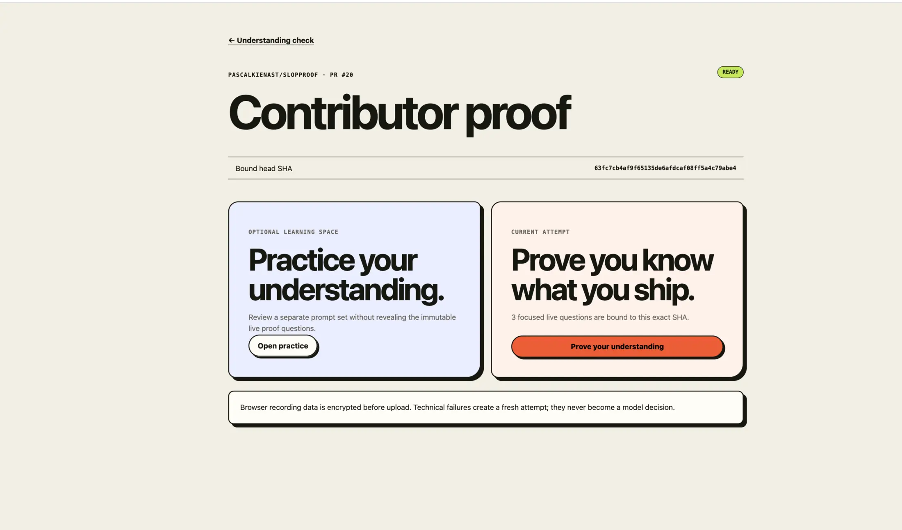
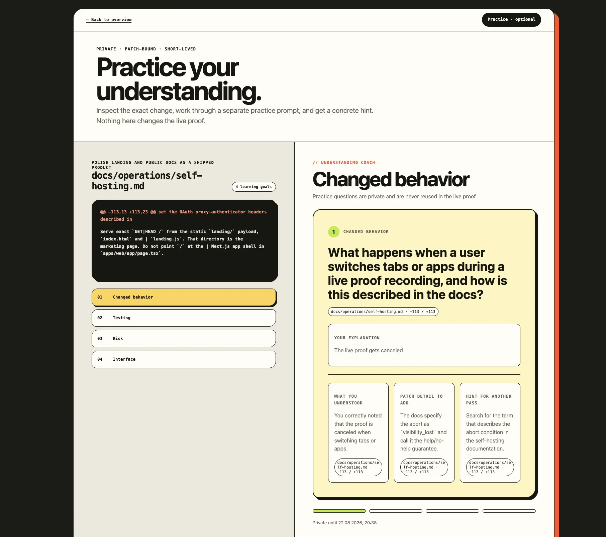
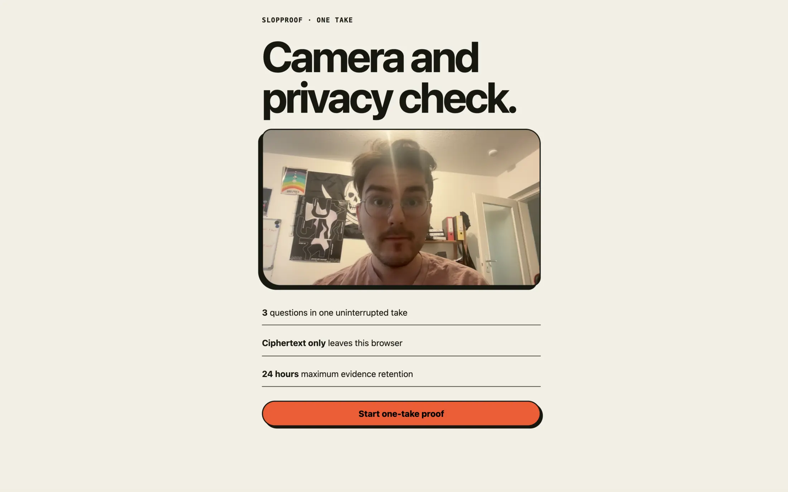
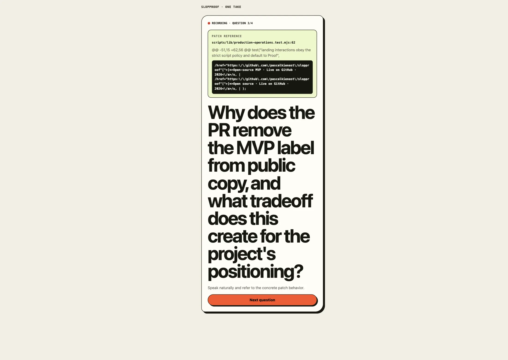
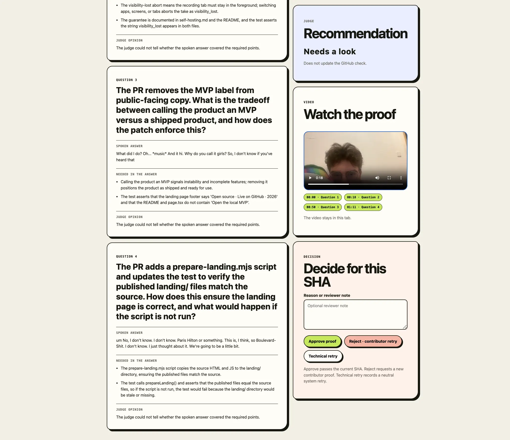
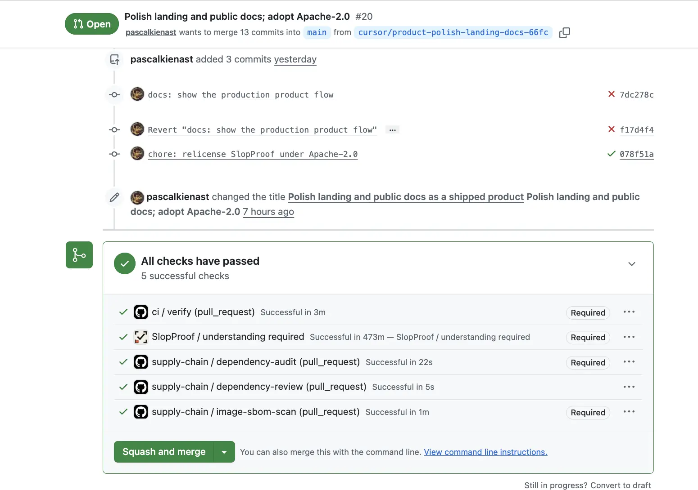

<p align="center">
  
</p>

# UnderstandProof

**Proof of Understanding for pull requests.**

Ask contributors to explain their changes before you merge. UnderstandProof adds
a GitHub check that maintainers can require before merging: the PR author answers
questions about the patch in a short video recorded on their phone.

Contributors can use AI-written code; the check asks them to explain what they
submit. Maintainers get an explanation to review alongside the diff and tests.

[](https://github.com/pascalkienast/understandproof/actions/workflows/ci.yml)
[](https://github.com/pascalkienast/understandproof/actions/workflows/supply-chain.yml)
[](LICENSE)

[Join the hosted beta](https://understandproof.paskie.me/#closed-beta) ·
[Run the local demo](#run-it-locally) ·
[Self-host](docs/operations/self-hosting.md) ·
[Contribute](CONTRIBUTING.md)

## How it works

1. **Open a pull request.** The GitHub App posts a contributor link and creates
   a check for that revision.
2. **Prepare if you want.** Practice offers questions and coaching about the
   patch. It uses a separate question set and does not count toward the proof.
3. **Explain the change.** Scan the one-time QR link with your phone and answer
   the proof questions in one continuous recording. Keep the recording tab in
   front; switching away aborts the take.
4. **Review and decide.** A model evaluates the transcript and selected frames
   against the patch and rubric. A maintainer reviews the evidence and model
   findings, then approves the proof or requests another attempt. The model
   cannot approve a proof on its own.

Each proof belongs to one author and one exact commit. A new push invalidates
it. An expired attempt or a technical failure does not satisfy the required
check.

## Try it

Install the [GitHub App](https://github.com/apps/understandproof), select your
repositories, and submit the [hosted-beta form](https://understandproof.paskie.me/#closed-beta).
Your installation stays inactive until approved.

### Run it locally

With Git, Docker, and Compose installed:

```bash
git clone https://github.com/pascalkienast/understandproof.git
cd understandproof
docker compose up --build
```

Open <http://localhost:3000/demo>. The demo includes three synthetic pull
requests and local stand-ins for GitHub, storage, and model providers. You do
not need production credentials. Ports bind to `127.0.0.1`; keep demo mode off
public networks.

For source development with Node.js 24 and pnpm 10.8, follow the
[development setup](CONTRIBUTING.md#development-setup).

### Self-host

Follow the [self-hosting guide](docs/operations/self-hosting.md) to configure
your own GitHub App, storage, and model providers. The repository includes a
Docker Compose deployment and encrypted backup/restore tooling. Production
setup requires operator configuration beyond starting the demo.

UnderstandProof is pre-1.0. Configuration and migrations can change between
releases. See [project status](docs/project-status.md) for deployment limits.

## Product tour

The contributor starts from the bot comment on their pull request:

<p align="center">
  
</p>

<details>
  <summary><strong>See Practice, recording, and maintainer review</strong></summary>
  <br>

  <p>Contributors can open Practice or go straight to Proof.</p>
  <p align="center">
    
  </p>

  <p>Practice includes a patch map and coaching feedback.</p>
  <p align="center">
    
  </p>

  <p>The phone flow starts with a camera and privacy check, then presents the proof questions.</p>
  <table>
    <tr>
      <td width="50%" align="center">
        
      </td>
      <td width="50%" align="center">
        
      </td>
    </tr>
  </table>

  <p>Maintainers can inspect the recording, transcript, and model findings before deciding.</p>
  <p align="center">
    
  </p>

  <p>The completed check appears on GitHub for the same commit.</p>
  <p align="center">
    
  </p>
</details>

<sub>These are production captures. Some show the earlier branding; see [capture notes](docs/assets/README.md).</sub>

## Recording and privacy

The browser encrypts recordings before upload. The worker decrypts the evidence
for transcription and model evaluation; configured providers receive the data
described in the [provider data flow](docs/privacy/provider-data-flow.md).
Recordings and transcripts stay out of public GitHub comments and checks.

Evidence has a maximum retention of 24 hours and may be deleted sooner after
completion.

The recording rules forbid outside help or notes. Tab monitoring enforces the
foreground rule; it cannot detect all outside assistance. A passing result
supports code review and tests rather than replacing them.

UnderstandProof does not execute pull-request code or use face recognition,
gaze tracking, or persistent contributor scores.

Before running it for other people, read the [threat model](docs/security/threat-model.md)
and [production configuration](docs/operations/production-configuration.md).
Operators are responsible for consent, provider terms, and retention notices.
Report vulnerabilities through [SECURITY.md](SECURITY.md).

## Contributing

Bug reports, focused fixes, and documentation improvements are welcome. Read
[CONTRIBUTING.md](CONTRIBUTING.md) for setup and checks; open an issue before
changing recording, retention, or authorization behavior.

<details>
  <summary><strong>Repository layout</strong></summary>

- `apps/web` — contributor, phone, and maintainer interfaces
- `apps/worker` — background jobs, media processing, evaluation, and retention
- `apps/github-control` — GitHub credentials and event processing
- `packages/` — domain rules, database, patch analysis, storage, and providers
- `landing/` — public website
- `scripts/` — verification, release, and backup tooling
- `docs/` — architecture, security, and operating guides

</details>

[Documentation](docs/README.md) · [Support](SUPPORT.md) ·
[Code of conduct](CODE_OF_CONDUCT.md)

## License

[Apache 2.0](LICENSE). Maintained by [Pascal Kienast](https://github.com/pascalkienast).
Copyright © 2026 Pascal Kienast and contributors.
